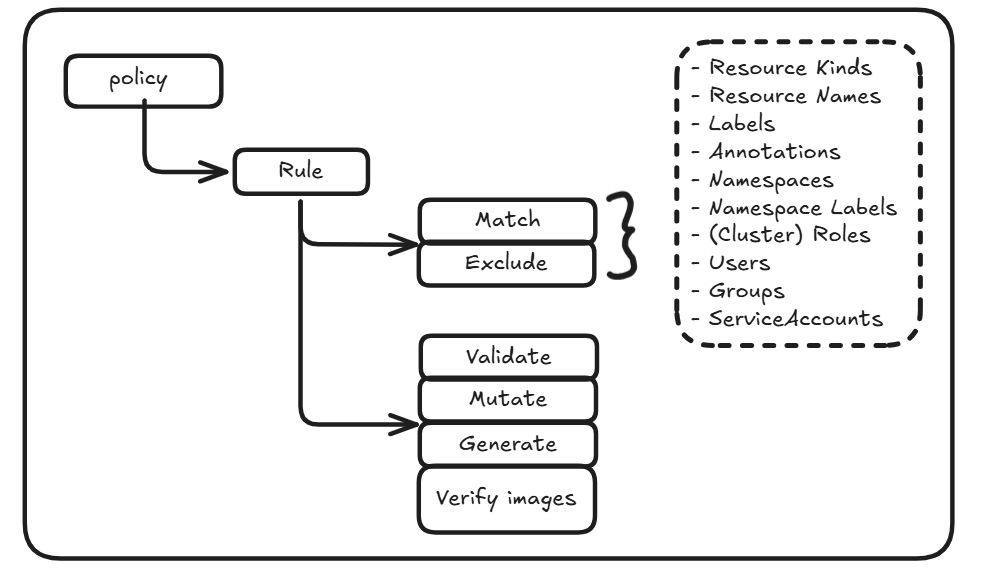
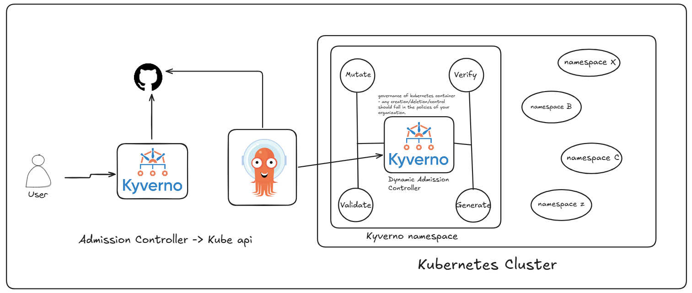
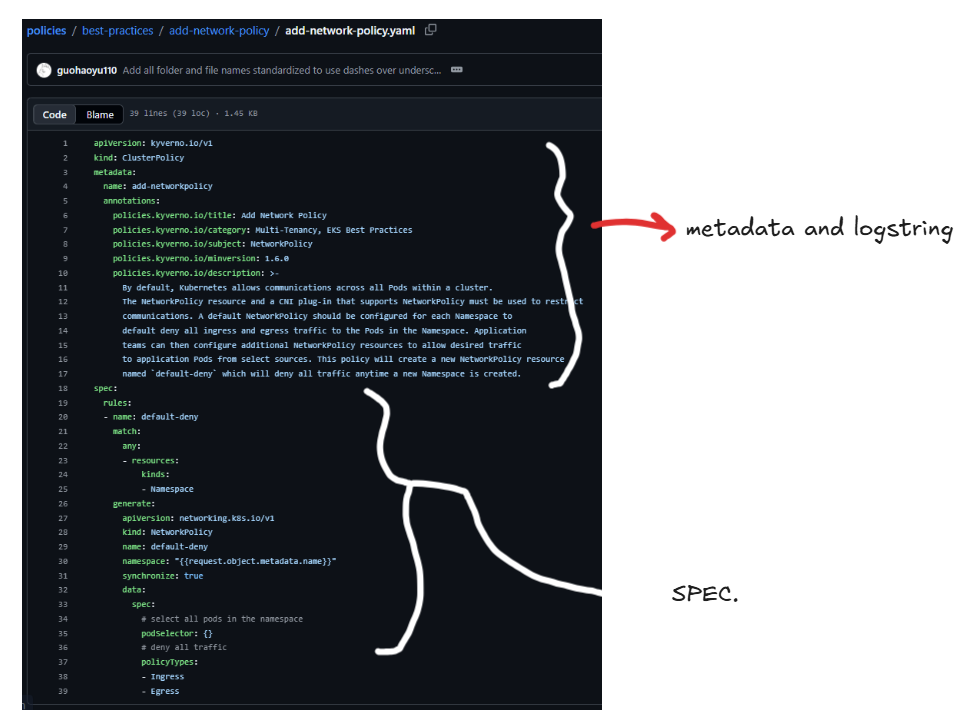
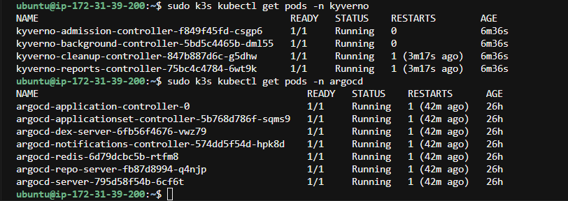
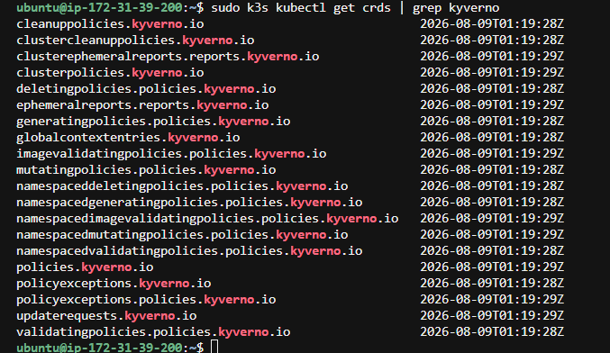
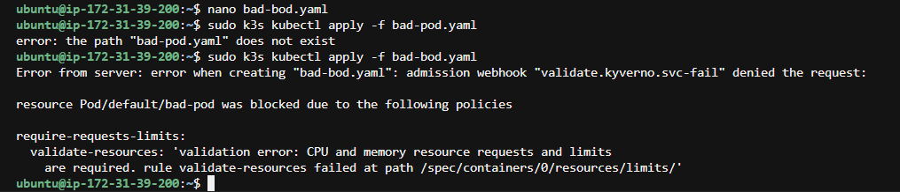
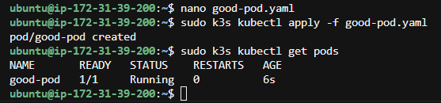

# Kyverno + ArgoCD on Kubernetes — AWS t3.large

I spun up an EC2 t3.large on AWS running Ubuntu and installed k3s on it. k3s is just a lightweight Kubernetes distribution — it gives you a fully working cluster without the heavy setup that comes with something like kubeadm. Once that was up, I had a real Kubernetes cluster on a single node and could start building on top of it.

The project combines two tools: **Kyverno** for policy enforcement and **ArgoCD** for GitOps. The idea is that your Kyverno policies live in a GitHub repo, ArgoCD continuously syncs them into the cluster, and Kyverno enforces them on every resource that gets created. So the whole governance of your cluster is version-controlled and automated — you never manually apply a policy, you just push to Git and ArgoCD takes care of the rest.

---

## How Kyverno works

Kyverno runs inside the cluster as a Dynamic Admission Controller. Every time someone tries to create, update, or delete a Kubernetes resource, that request goes through Kyverno before it reaches the API server. Kyverno looks at the request, checks it against whatever policies are loaded, and decides what to do. It can validate the resource and block it if something's wrong, mutate it by auto-adding missing fields, generate new resources in response to events, or verify container image signatures. You write policies in plain YAML — same format as everything else in Kubernetes — which makes it feel natural.

The flow in this project is: you as the user write a Kyverno policy and push it to GitHub. ArgoCD is watching that repo and syncs the policy into the cluster automatically. From that point, Kyverno is enforcing that policy on every new pod or resource that comes in.

---

## What a policy looks like

A Kyverno policy YAML has two main sections. The metadata section at the top holds the name, and Kyverno also has its own annotation keys where you describe the policy's title, category, and what it does — these show up in Kyverno's policy library. Below that is the spec section where the actual rules are. Each rule has a match block (which resources it applies to) and then the action — in this case validate, which checks the resource and rejects it if it doesn't meet the condition.

The specific policy I wrote is called `require-requests-limits`. It targets every Pod and checks that CPU and memory requests and limits are all defined under the container's resources section. Without resource limits, a runaway pod can eat up all the CPU or memory on the node and take everything else down with it. This policy makes that impossible.

---

## Getting everything running

After installing k3s, I installed Kyverno using Helm by adding the Kyverno Helm repo and running `helm install` into the kyverno namespace. ArgoCD was also installed in its own namespace. Once both were up, I ran `kubectl get pods` in each namespace to confirm everything was healthy. All pods came up as `1/1 Running`.

Kyverno installs a lot of CRDs when it comes up — cluster policies, namespaced policies, mutating policies, validating policies, ephemeral reports, and more. Running `kubectl get crds | grep kyverno` shows the full list. This is what gives you the flexibility to write very targeted policies at whatever scope you need.

---

## Testing the policy

To test that the policy was actually doing its job, I made two pod manifests. The first was a bad pod — just a plain nginx container with no resource section whatsoever. I applied it with `kubectl apply -f bad-pod.yaml` and Kyverno immediately rejected it. The error came back from the admission webhook saying the `require-requests-limits` rule failed because CPU and memory requests and limits are required. The pod never got created.

The second manifest was a good pod — same nginx container but with proper CPU and memory requests and limits defined. Applied it, and it went straight through. A few seconds later it was showing up as `Running`.

That's the whole project. ArgoCD keeps the policies in sync from Git so you never have to touch the cluster manually, and Kyverno enforces those policies on every single resource that comes in. Together they give you a cluster where the rules are automated, auditable, and consistent across everything.
